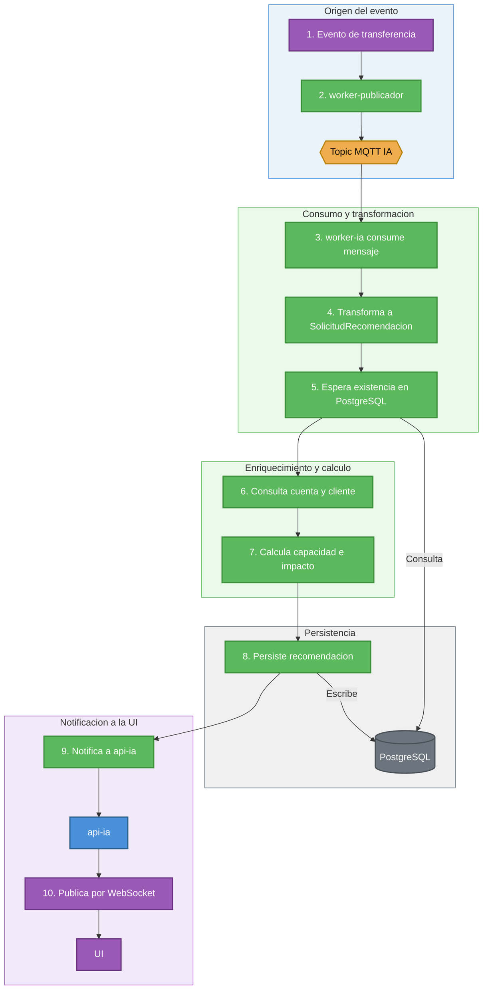
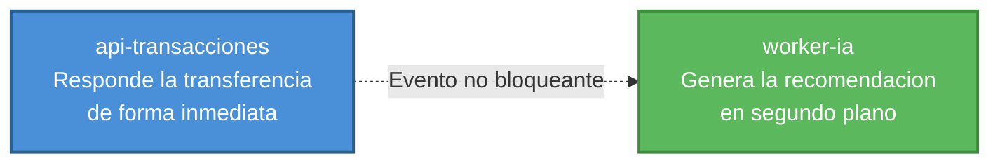

# Arquitectura de la API de IA

## Responsabilidad

Generar recomendaciones financieras personalizadas a partir de eventos de transferencia sin bloquear la respuesta de la API transaccional.

## Componentes

- `api-ia`: expone salud, metricas, endpoint interno de notificacion y WebSocket.
- `worker-ia`: consume eventos desde MQTT, construye solicitudes de recomendacion, consulta datos financieros, persiste la recomendacion y notifica a la UI.
- `servicios/recomendaciones.py`: contiene las reglas de clasificacion y construccion del mensaje.
- `repositorios`: consulta cuentas, clientes y persiste recomendaciones.

## Flujo

1. La transferencia genera un evento.
2. `worker-publicador` publica el evento en el topic MQTT de IA.
3. `worker-ia` consume el mensaje.
4. El worker transforma el evento en `SolicitudRecomendacion`.
5. Espera brevemente a que la transaccion exista en PostgreSQL, porque persistencia e IA trabajan en paralelo.
6. Consulta datos de cuenta y cliente.
7. Calcula capacidad financiera e impacto de liquidez.
8. Persiste la recomendacion si no existe.
9. Notifica a `api-ia`.
10. `api-ia` publica por WebSocket a la UI.

## Modelo de IA implementado en el MVP

El MVP usa un modelo basado en reglas de negocio, tomando en consideración que los datos financieros no pueden salir a red, por este motivo no se empleo ua API Key de una modelo Open Source:

- `capacidad_financiera`: compara gastos mensuales contra ingresos.
- `impacto_liquidez`: compara monto de transferencia contra saldo.
- `recomendacion`: texto generado segun la combinacion de ambos indicadores.

Clasificaciones:

- Capacidad financiera: `FAVORABLE`, `MODERADA`, `REDUCIDA`.
- Impacto de liquidez: `BAJO`, `MODERADO`, `ALTO`.

## Patrones de diseno y arquitectura usados

| Patron | Descripcion |
|---|---|
| Event-Driven Consumer | La IA se activa por eventos MQTT. |
| Worker Pattern | El procesamiento pesado vive fuera del request HTTP. |
| Service Layer | Las reglas se concentran en `servicios/recomendaciones.py`. |
| Repository Pattern | Consultas y persistencia estan separadas de las reglas. |
| DTO / Schema Pattern | Pydantic modela solicitudes, respuestas y notificaciones. |
| Backpressure basico | `worker-ia` usa una cola interna con limite y un semaforo de concurrencia. |
| Composition over Inheritance | Las funciones y servicios componen comportamiento sin jerarquias de clases innecesarias. |

## Por que no bloquea la transaccion

La API de transacciones no llama a IA de forma sincrona. Solo genera el evento. La recomendacion se produce despues, mediante MQTT y worker independiente. Si IA esta lenta o temporalmente caida, la transferencia puede responder igual.

