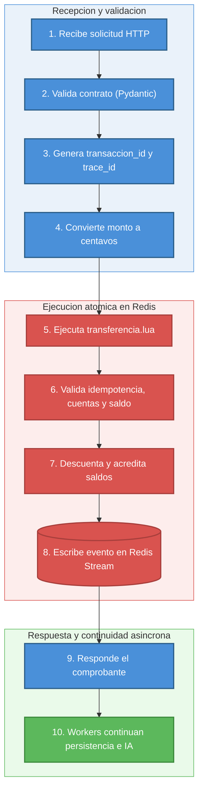

# Arquitectura de la API de transacciones

## Responsabilidad

Procesar solicitudes de transferencia con baja latencia, validando el contrato, ejecutando la operacion atomica de saldo e iniciando el flujo asincrono de persistencia e IA.

## Endpoint principal

```http
POST /api/transacciones
```

Contrato de entrada:

```json
{
  "cuenta_origen_id": 1001,
  "cuenta_destino_id": 1002,
  "monto": 1,
  "moneda": "USD",
  "descripcion": "Pago de prueba",
  "clave_idempotencia": "abc-123"
}
```

Comprobante de salida:

```json
{
  "transaccion_id": "TX-...",
  "estado": "COMPLETADA",
  "motivo": "OK",
  "cuenta_origen_id": 1001,
  "cuenta_destino_id": 1002,
  "monto": 1,
  "moneda": "USD",
  "descripcion": "Pago de prueba",
  "clave_idempotencia": "abc-123"
}
```

El campo `motivo` se incluye para explicar el resultado de negocio del comprobante: `OK`, `FONDOS_INSUFICIENTES`, `CUENTA_ORIGEN_NO_EXISTE`, `CUENTA_DESTINO_NO_EXISTE`, `MONTO_INVALIDO`, entre otros.

## Flujo interno

1. `rutas/transacciones.py` recibe la solicitud HTTP.
2. Pydantic valida cuentas, monto minimo, moneda `USD`, descripcion y clave de idempotencia.
3. `ServicioTransacciones` genera `transaccion_id` y `trace_id`.
4. Convierte el monto a centavos para evitar errores de coma flotante.
5. Ejecuta `transferencia.lua` en Redis.
6. Redis valida idempotencia, existencia de cuentas y saldo.
7. Redis descuenta y acredita saldos.
8. Redis escribe el evento en `Redis Stream`.
9. La API responde el comprobante.
10. Los workers continuan persistencia e IA fuera del request HTTP.



## Patrones de diseno y arquitectura usados

| Patron | Descripcion |
|---|---|
| Service Layer | `ServicioTransacciones` concentra el caso de uso. |
| Dependency Injection | La ruta recibe el servicio mediante `Depends`; la instancia real se configura en el `lifespan` de FastAPI. |
| Repository Pattern | El acceso a PostgreSQL se ubica en `repositorios`, separado del dominio y rutas. |
| Adapter / Infrastructure Layer | Redis, PostgreSQL, MQTT, metricas y logging estan encapsulados bajo `infraestructura`. |
| Idempotency Key Pattern | `clave_idempotencia` garantiza que un retry no duplique la transferencia. |
| Event-Driven / Producer Pattern | La API produce un evento transaccional para persistencia e IA. |
| Transaction Script Pattern | Lua en Redis concentra una operacion atomica cercana al dato. |
| Composition over Inheritance | El servicio recibe objetos colaboradores como `ScriptsRedis` y compone el comportamiento sin herencia. |

## Manejo de concurrencia

La seccion critica se resuelve mediante Redis Lua. Redis ejecuta cada script de forma atomica: mientras el script corre, ningun otro comando puede intercalarse sobre esas mismas claves. Esto evita condiciones de carrera entre la validacion de saldo y su actualizacion.

## Idempotencia

La clave `clave_idempotencia` se guarda en Redis con el resultado final. Si llega la misma solicitud otra vez, el script devuelve la respuesta anterior sin volver a debitar ni acreditar.

## Eventos posteriores

El evento se escribe en Redis Stream con:

- `transaccion_id`
- `trace_id`
- `cuenta_origen_id`
- `cuenta_destino_id`
- `monto`
- `moneda`
- `descripcion`
- `clave_idempotencia`
- `estado`
- `motivo`

## Observabilidad

La API expone:

- `/health`
- `/metrics`

Metricas relevantes:

- total de transacciones por estado y motivo
- duracion HTTP
- duracion de Redis/Lua
- errores de transaccion

Logs relevantes:

- `trace_id`
- `transaccion_id`
- `estado`
- `motivo`
- `clave_idempotencia`
- duracion en milisegundos

## Pruebas de carga

El requerimiento de negocio es que cada transaccion responda en un maximo de 2 segundos. Las pruebas se ejecutaron con k6 sobre `api-transacciones` levantada con 4 workers de Uvicorn, 4 cores asignados a Docker Desktop, incrementando gradualmente la tasa de transacciones por segundo TPS para identificar el punto donde la configuracion actual deja de sostener el tiempo de respuesta esperado.

### Prueba a 1000 TPS (`RATE=1000`, `DURATION=10s`)

| Metrica | Resultado |
|---|---|
| p95 `http_req_duration` | 9.51 ms (umbral interno <200 ms ✓) |
| p99 `http_req_duration` | 31.22 ms (umbral interno <500 ms ✓) |
| Tasa de error | 0.00% |
| Iteraciones completadas | 10 000 / 10 000 |
| VUs usados | 45 de 500 maximos |

<details>
<summary>Salida completa de k6</summary>

```text
(.venv) C:\Users\juanl\OneDrive\Desktop\RETO_TCS\api-transacciones>k6 run -e RATE=1000 -e DURATION=10s tests/carga/carga_transacciones.js

  █ THRESHOLDS

    http_req_duration
    ✓ 'p(95)<200' p(95)=9.51ms
    ✓ 'p(99)<500' p(99)=31.22ms

    http_req_failed
    ✓ 'rate<0.01' rate=0.00%

  █ TOTAL RESULTS

    checks_total.......: 30000   2999.618089/s
    checks_succeeded...: 100.00% 30000 out of 30000
    checks_failed......: 0.00%   0 out of 30000

    HTTP
    http_req_duration..............: avg=3.95ms min=513.7µs med=2.58ms max=154.36ms p(90)=5.86ms p(95)=9.51ms
    http_req_failed................: 0.00%  0 out of 10000
    http_reqs......................: 10000  999.872696/s

    EXECUTION
    vus............................: 3      min=2          max=45
    vus_max........................: 500    min=500        max=500

running (10.0s), 00000/00500 VUs, 10000 complete and 0 interrupted iterations
transacciones ✓ [======================================] 00000/00500 VUs  10s  1000.00 iters/s
```

</details>

Uso de recursos durante la prueba (`docker stats`):

| Contenedor | CPU % | Memoria |
|---|---|---|
| `api_transacciones` | 148.03% | 309.7 MiB |
| `worker_ia` | 99.21% | 83.69 MiB |
| `worker_publicador_eventos` | 82.71% | 25.84 MiB |
| `worker_persistencia` | 51.15% | 45.98 MiB |
| `postgres_transacciones` | 35.03% | 205.4 MiB |
| `redis_streams` | 21.06% | 63.61 MiB |
| `api_ia` | 6.85% | 34.57 MiB |

A 1000 TPS el sistema responde con holgura: `api_transacciones` usa 148% de CPU, muy por debajo del 400% disponible con sus 4 workers, y las latencias se mantienen en milisegundos de un solo digito.

### Prueba a 2000 TPS (`RATE=2000`, `DURATION=30s`)

| Metrica | Resultado |
|---|---|
| p95 `http_req_duration` | 201.42 ms (umbral interno <200 ms ✗, por 1.42 ms) |
| p99 `http_req_duration` | 283.01 ms (umbral interno <500 ms ✓) |
| Tasa de error | 0.00% |
| Iteraciones completadas | 59 933 |
| Iteraciones descartadas | 68 |
| VUs usados | 497 de 532 maximos |

<details>
<summary>Salida completa de k6</summary>

```text
(.venv) C:\Users\juanl\OneDrive\Desktop\RETO_TCS\api-transacciones>k6 run -e RATE=2000 -e DURATION=30s tests/carga/carga_transacciones.js

  █ THRESHOLDS

    http_req_duration
    ✗ 'p(95)<200' p(95)=201.42ms
    ✓ 'p(99)<500' p(99)=283.01ms

    http_req_failed
    ✓ 'rate<0.01' rate=0.00%

  █ TOTAL RESULTS

    checks_total.......: 179799  5983.590687/s
    checks_succeeded...: 100.00% 179799 out of 179799
    checks_failed......: 0.00%   0 out of 179799

    HTTP
    http_req_duration..............: avg=51.75ms min=519.8µs med=23.96ms max=366.32ms p(90)=148.22ms p(95)=201.42ms
    http_req_failed................: 0.00% 0 out of 59933
    http_reqs......................: 59933 1994.530229/s

    EXECUTION
    dropped_iterations.............: 68    2.262995/s
    vus............................: 140   min=7          max=497
    vus_max........................: 532   min=500        max=532

running (0m30.0s), 00000/00532 VUs, 59933 complete and 0 interrupted iterations
transacciones ✓ [======================================] 00000/00532 VUs  30s  2000.00 iters/s
ERRO[0030] thresholds on metrics 'http_req_duration' have been crossed
```

</details>

El umbral interno definido en el script de k6 (p95 < 200 ms) no se cumplio, pero por un margen minimo: 201.42 ms. El requerimiento real de negocio es de hasta 2 segundos por transaccion, por lo que el resultado sigue siendo valido para el caso de uso. Incluso si se endurece el objetivo a 1 segundo por transaccion, la latencia obtenida (p95 de ~201 ms) queda muy por debajo de ese limite.

### Prueba a 3000 TPS (`RATE=3000`, `DURATION=30s`, `VALIDAR_NEGOCIO=false`)

| Metrica | Resultado |
|---|---|
| p95 `http_req_duration` | 5.68 s (umbral interno <200 ms ✗) |
| p99 `http_req_duration` | 6.03 s (umbral interno <500 ms ✗) |
| Promedio (avg) | 3.22 s |
| Tasa de error | 0.00% |
| Iteraciones completadas | 58 953 |
| Iteraciones descartadas | 31 048 |
| VUs usados | 10 000 (limite maximo alcanzado) |

<details>
<summary>Salida completa de k6</summary>

```text
(.venv) C:\Users\juanl\OneDrive\Desktop\RETO_TCS\api-transacciones>k6 run -e RATE=3000 -e DURATION=30s -e VALIDAR_NEGOCIO=false tests/carga/carga_transacciones.js

WARN[0023] Insufficient VUs, reached 10000 active VUs and cannot initialize more  executor=constant-arrival-rate scenario=transacciones

  █ THRESHOLDS

    http_req_duration
    ✗ 'p(95)<200' p(95)=5.68s
    ✗ 'p(99)<500' p(99)=6.03s

    http_req_failed
    ✓ 'rate<0.01' rate=0.00%

  █ TOTAL RESULTS

    checks_total.......: 176859  5401.781189/s
    checks_succeeded...: 100.00% 176859 out of 176859
    checks_failed......: 0.00%   0 out of 176859

    HTTP
    http_req_duration..............: avg=3.22s min=24.32ms med=3.39s max=6.25s p(90)=5.46s p(95)=5.68s
    http_req_failed................: 0.00% 0 out of 58953
    http_reqs......................: 58953 1800.59373/s

    EXECUTION
    dropped_iterations.............: 31048 948.294983/s
    vus............................: 3095  min=816        max=10000
    vus_max........................: 10000 min=887        max=10000

running (0m32.7s), 00000/10000 VUs, 58953 complete and 0 interrupted iterations
transacciones ✓ [======================================] 00000/10000 VUs  30s  3000.00 iters/s
ERRO[0033] thresholds on metrics 'http_req_duration' have been crossed
```

</details>

Uso de recursos durante la prueba (`docker stats`):

| Contenedor | CPU % | Memoria |
|---|---|---|
| `api_transacciones` | 420.11% | 609.5 MiB |
| `worker_ia` | 104.91% | 93.6 MiB |
| `worker_publicador_eventos` | 73.56% | 25.85 MiB |
| `worker_persistencia` | 40.57% | 46.42 MiB |
| `postgres_transacciones` | 42.60% | 268.8 MiB |
| `redis_streams` | 31.03% | 112.4 MiB |
| `api_ia` | 7.31% | 34.58 MiB |

A 3000 TPS el tiempo de respuesta promedio sube a 3.22 segundos, superando el requerimiento de 2 segundos por transaccion. `api_transacciones` alcanza 420% de CPU, es decir, satura sus 4 workers de Uvicorn, con 4 nucleos el maximo teorico es 400%. k6 tambien reporta 31 048 iteraciones descartadas y agota el limite de 10 000 VUs configurado, lo cual confirma que el cuello de botella esta en la capacidad de computo de la API, no en Redis ni en PostgreSQL, cuyo uso de recursos se mantiene proporcionalmente bajo.

### Conclusion y ruta de escalamiento

Con la configuracion actual 4 workers de Uvicorn el sistema sostiene con holgura hasta 2000 TPS cumpliendo el requerimiento de negocio de maximo 2 segundos por transaccion. Para sostener cargas mayores 3000 TPS en adelante se requiere:

- **Escalamiento vertical:** aumentar el numero de workers de Uvicorn en `api-transacciones`.
- **Escalamiento horizontal:** agregar mas replicas del contenedor de la API detras de un balanceador.
- **Mas consumidores de eventos:** crear mas consumidores en el grupo de Redis Stream para que `worker-persistencia` y `worker-ia` absorban el mismo ritmo de transacciones que genera la API.
