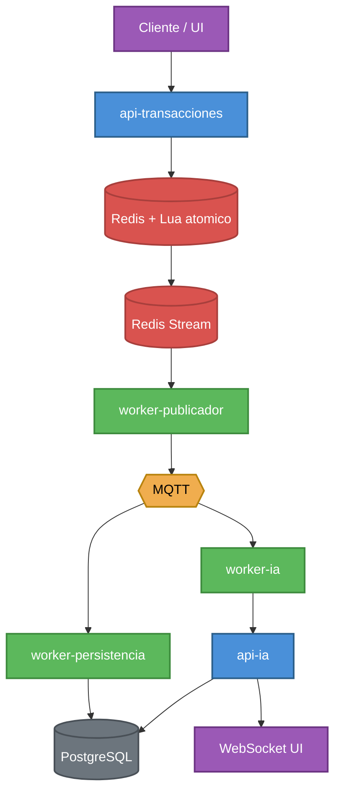

# Arquitectura general

## Objetivo

SmartBancs App busca procesar transferencias en tiempo real y generar recomendaciones financieras sin bloquear el flujo transaccional principal.

## Vista de alto nivel

## Componentes

| Componente | Descripcion |
|---|---|
| `api-transacciones` | Recibe transferencias, valida el contrato, ejecuta el procesamiento atomico en Redis y responde el comprobante. |
| `Redis` | Mantiene saldos operativos de baja latencia, claves de idempotencia y Redis Stream para desacoplar el procesamiento posterior. |
| `worker-publicador` | Lee Redis Stream y publica eventos hacia MQTT. |
| `MQTT` | Bus liviano de eventos para persistencia e IA. |
| `worker-persistencia` | Persiste transacciones en PostgreSQL por lotes; maneja duplicados y DLQ. |
| `PostgreSQL` | Repositorio duradero para transacciones, clientes, cuentas y recomendaciones. |
| `api-ia` | Expone endpoints de salud, metricas y WebSocket para recomendaciones. |
| `worker-ia` | Consume eventos de transferencia y genera recomendaciones con reglas de negocio. |
| `VictoriaMetrics` / `Grafana` / `Loki` / `Alloy` | Metricas, dashboards y logs centralizados. |

## Decisiones de arquitectura

### Modelo principal

Se usa una arquitectura de microservicios livianos orientada a eventos. La API de transacciones no espera a que PostgreSQL ni IA finalicen para responder; solo confirma que la operacion atomica en Redis termino.

- **Persistencia por lotes:** los workers agrupan las escrituras insertando lotes de 100 registros y ejecutando un unico commit por lote, lo que reduce el overhead transaccional sobre PostgreSQL y ayuda a mantener el ritmo de la cola de eventos.
- **Trazabilidad end-to-end:** cada transaccion genera un `trace_id` que permite rastrear y filtrar toda la traza de una peticion a traves de los distintos componentes (API, workers, logs).
- **Redis Lua como motor transaccional:** se eligio Lua porque se ejecuta de forma muy rapida dentro de Redis, y Redis ya soporta scripts Lua de manera nativa, sin necesidad de infraestructura adicional.

### Patrones usados

| Patron | Descripcion |
|---|---|
| Layered Architecture | Separa rutas, servicios, dominio, repositorios e infraestructura. |
| Event-Driven Architecture | Redis Stream y MQTT desacoplan persistencia e IA. |
| Producer/Consumer | La API produce eventos; los workers los consumen. |
| Transactional Outbox simplificado | La operacion atomica en Redis escribe el evento en Redis Stream como parte del mismo script Lua. |
| Repository Pattern | Encapsula consultas e inserciones de PostgreSQL. |
| Dependency Injection | FastAPI inyecta el servicio de transacciones inicializado en `lifespan`. |
| Idempotency Key Pattern | Evita procesar dos veces la misma transferencia. |
| DLQ Pattern | Payloads invalidos se envian a una cola de errores para analisis. |

## Cumplimiento con ACID

La concurrencia critica se resuelve enteramente dentro de Redis mediante un unico script Lua, lo que permite sostener las cuatro propiedades ACID sin necesidad de bloqueos explicitos en la aplicacion:

- **Atomicidad:** Redis ejecuta cada script Lua como una unidad indivisible. La validacion de saldo, el debito, el credito, el registro de idempotencia y la escritura del evento en Redis Stream ocurren dentro de la misma operacion atomica: o se completan todos los pasos, o no se aplica ninguno.
- **Consistencia:** el motor de Lua en Redis es monohilo (single-threaded); mientras un script se ejecuta, ningun otro comando puede intercalarse sobre las mismas claves. Esto garantiza que el sistema pase siempre de un estado de saldos valido a otro estado de saldos valido, sin lecturas ni escrituras parciales.
- **Aislamiento:** por esa misma ejecucion monohilo y atomica, dos transferencias concurrentes nunca se entrelazan ni compiten por el mismo recurso; no existen condiciones de carrera ni deadlocks entre scripts.
- **Durabilidad:** una vez que la operacion en Redis concluye, el evento queda registrado en Redis Stream y PostgreSQL actua como almacenamiento duradero de largo plazo. `worker-persistencia` escribe por lotes hacia PostgreSQL, aportando la garantia de durabilidad ante caidas del proceso o reinicios, mientras Redis se enfoca en la baja latencia del camino caliente.

## Escalabilidad

La escalabilidad del sistema se apoya en que ningun componente depende de escribir directamente sobre PostgreSQL en el camino critico. `api-transacciones` corre con 4 workers de Uvicorn, y tanto ese componente como los workers de persistencia e IA pueden escalarse horizontalmente porque consumen eventos por grupos y colas, lo que permite levantar mas replicas sin modificar la logica de negocio. MQTT desacopla a los consumidores por dominio, de modo que persistencia e IA pueden crecer de forma independiente segun su propia carga. Redis absorbe el camino caliente de la transferencia gracias a su baja latencia en memoria, mientras que PostgreSQL recibe las escrituras agrupadas por lotes desde los workers en lugar de una escritura directa por cada request HTTP, reduciendo asi la presion sobre la base de datos durante picos de carga.

## Tolerancia a fallos

El sistema esta diseñado para degradarse sin perder datos ante fallos parciales. Si MQTT no esta disponible, el evento generado por la transferencia permanece pendiente en Redis Stream hasta que pueda publicarse, sin bloquear a la API. Si PostgreSQL falla, `worker-persistencia` simplemente no confirma el mensaje consumido, por lo que el evento vuelve a estar disponible para reprocesarse y no se pierde. Cuando un payload llega corrupto o invalido, se envia a la DLQ antes de confirmar el mensaje original, aislando el error sin detener el flujo del resto de transacciones. Finalmente, la clave de idempotencia protege todo el flujo frente a reintentos del cliente, evitando que una misma transferencia se procese mas de una vez aunque la solicitud se repita.