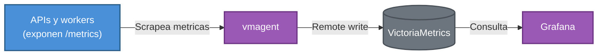

# Observabilidad y operacion

## Objetivo

Definir que informacion permite identificar problemas de rendimiento, degradacion, timeouts, errores y bloqueos durante picos transaccionales.

## Stack implementado



| Componente | Rol |
|---|---|
| Prometheus client | Libreria embebida en las APIs y workers para exponer metricas en formato `/metrics`. |
| vmagent | Recolecta (scrapea) las metricas expuestas por cada componente. |
| VictoriaMetrics | Almacena las series de tiempo recolectadas por vmagent. |
| Grafana | Consume VictoriaMetrics para construir los dashboards de la solucion. |
| Loki | Almacena y centraliza los logs de la aplicacion. |
| Alloy | Recolecta los logs de los contenedores y los envia a Loki. |

## URLs

- Targets de vmagent: `http://localhost:8430/targets`
- VictoriaMetrics VMUI: `http://localhost:8429/vmui`
- Grafana: `http://localhost:3000/`

## Senales usadas

### Metricas

- volumen de transacciones por segundo
- transacciones por estado
- transacciones por motivo
- latencia HTTP de la API
- duracion del script Lua
- eventos publicados a MQTT
- errores MQTT
- eventos persistidos
- eventos duplicados
- eventos enviados a DLQ
- recomendaciones procesadas
- errores de IA

### Logs

Los logs incluyen campos estructurados para trazabilidad. Se genera un registro en cada punto clave del flujo: cuando la transaccion se procesa mediante el script Lua, cuando el evento se publica en Redis Stream, y cuando es consumido por los workers de persistencia, el publicador de eventos y la IA. Esto garantiza una trazabilidad completa de cada transferencia a lo largo de todo el pipeline.

- `trace_id`
- `transaccion_id`
- `estado`
- `motivo`
- `clave_idempotencia`
- componente
- evento
- duracion

### Trazabilidad

El mismo `trace_id` viaja desde la API de transacciones hacia Redis Stream, MQTT, persistencia e IA. Esto permite buscar una transferencia especifica entre componentes.

## Diagnostico del incidente simulado

Escenario: en quincena, las transferencias no se completan; hay latencia alta, timeouts con base de datos y posibles deadlocks.

### Que revisar primero

1. Grafana: latencia p95/p99 de `api-transacciones`.
2. Grafana: errores por componente.
3. Logs de `api_transacciones` buscando `trace_id` o excepciones.
4. Logs de `worker_persistencia` buscando errores temporales de PostgreSQL.
5. Metricas de eventos pendientes o no confirmados.
6. PostgreSQL: conexiones activas, consultas lentas y bloqueos.

### Comandos utiles

```powershell
docker logs -f api_transacciones
docker logs -f worker_publicador_eventos
docker logs -f worker_persistencia
docker logs -f worker_ia
docker compose ps
```

## Catalogo de metricas Prometheus por componente

Cada componente expone sus propias metricas para poder aislar en que punto exacto del flujo (API, Redis/Lua, MQTT, persistencia o IA) se origina una degradacion, un timeout o un error, en lugar de depender unicamente de los logs.

### API de transacciones

| Metrica | Que mide | Por que se usa |
|---|---|---|
| `smartbancs_transacciones_total` | Transacciones procesadas, por estado y motivo. | Muestra el volumen real de negocio y permite detectar si un motivo de rechazo (por ejemplo, fondos insuficientes) se dispara de forma anormal. |
| `smartbancs_errores_transacciones_total` | Errores ocurridos al procesar transacciones. | Alerta de forma temprana ante fallos que impiden completar una transaccion. |
| `smartbancs_http_transaccion_duracion_seconds` | Tiempo de respuesta del endpoint `POST /api/transacciones`. | Es la metrica central para detectar degradacion de latencia percibida por el cliente. |
| `smartbancs_redis_lua_duracion_seconds` | Duracion de la operacion atomica en Redis/Lua. | Permite aislar si la lentitud proviene del camino critico en Redis o de otra capa. |
| `smartbancs_timeouts_total` | Timeouts detectados, por componente. | Detecta directamente escenarios como el del incidente simulado (timeouts en base de datos). |

### API de IA

| Metrica | Que mide | Por que se usa |
|---|---|---|
| `smartbancs_ia_recomendaciones_solicitadas_total` | Solicitudes de recomendacion hechas a la IA. | Mide la demanda real que recibe el servicio de IA. |
| `smartbancs_ia_recomendaciones_procesadas_total` | Recomendaciones generadas por la IA. | Permite comparar solicitadas vs. procesadas y detectar recomendaciones que quedan sin generar. |
| `smartbancs_ia_errores_total` | Errores del servicio de IA. | Aisla fallos propios de IA sin afectar el monitoreo de la transaccion principal. |
| `smartbancs_ia_recomendacion_duracion_seconds` | Tiempo usado para generar una recomendacion. | Confirma que la IA se mantiene no bloqueante y detecta si empieza a demorar mas de lo esperado. |

### Worker publicador

| Metrica | Que mide | Por que se usa |
|---|---|---|
| `smartbancs_eventos_stream_recibidos_total` | Eventos leidos desde Redis Stream. | Confirma que el worker esta consumiendo efectivamente los eventos generados por la API. |
| `smartbancs_eventos_mqtt_publicados_total` | Eventos publicados hacia MQTT, por destino. | Verifica que cada evento llega tanto a persistencia como a IA. |
| `smartbancs_errores_mqtt_total` | Errores al publicar eventos en MQTT. | Detecta problemas de conectividad o disponibilidad del broker. |
| `smartbancs_publicacion_mqtt_duracion_seconds` | Latencia de publicacion hacia MQTT. | Ayuda a identificar cuellos de botella en la etapa de mensajeria. |

### Worker de persistencia

| Metrica | Que mide | Por que se usa |
|---|---|---|
| `smartbancs_eventos_persistencia_recibidos_total` | Eventos recibidos para persistir. | Punto de partida para contrastar cuantos eventos finalmente se guardan. |
| `smartbancs_eventos_persistidos_total` | Transacciones guardadas correctamente en PostgreSQL. | Confirma que la persistencia realmente ocurre, no solo el consumo del evento. |
| `smartbancs_eventos_duplicados_total` | Eventos duplicados detectados. | Verifica que la proteccion contra duplicados esta funcionando. |
| `smartbancs_eventos_dlq_total` | Eventos enviados a la DLQ. | Senal temprana de payloads corruptos o invalidos que requieren revision manual. |
| `smartbancs_errores_persistencia_total` | Errores del worker de persistencia. | Detecta problemas de conexion o escritura hacia PostgreSQL, como los descritos en el incidente simulado. |
| `smartbancs_persistencia_duracion_seconds` | Tiempo de procesamiento y guardado en PostgreSQL. | Identifica si la base de datos se esta convirtiendo en el cuello de botella durante picos de carga. |

### Worker de IA

| Metrica | Que mide | Por que se usa |
|---|---|---|
| `smartbancs_ia_eventos_recibidos_total` | Eventos recibidos desde MQTT para analisis de IA. | Confirma que el worker de IA recibe el mismo flujo de eventos que persistencia. |
| `smartbancs_ia_eventos_descartados_total` | Eventos descartados por la IA, con su motivo. | Permite entender por que ciertos eventos no generan una recomendacion. |
| `smartbancs_ia_recomendaciones_solicitadas_total` | Recomendaciones solicitadas desde el worker. | Mide la demanda que llega al worker en si, antes de generar la recomendacion. |
| `smartbancs_ia_recomendaciones_procesadas_total` | Recomendaciones procesadas a partir de eventos. | Contrasta cuantas de las solicitudes se resuelven efectivamente. |
| `smartbancs_ia_recomendaciones_persistidas_total` | Recomendaciones guardadas en PostgreSQL. | Confirma que el ciclo completo (calculo + persistencia) se cerro correctamente. |
| `smartbancs_ia_errores_total` | Errores del worker de IA. | Aisla fallas especificas del procesamiento asincrono de IA. |
| `smartbancs_ia_recomendacion_duracion_seconds` | Tiempo de generacion de recomendacion. | Detecta degradacion de rendimiento especifica del calculo de recomendaciones. |

> Algunas metricas de recomendaciones (`solicitadas`, `procesadas`, `errores`, `duracion`) se repiten entre `api-ia` y `worker-ia` a proposito: cada una las expone desde su propia posicion en el pipeline, lo que permite comparar la vista externa (API) contra la vista interna (worker) y detectar en cual de las dos capas aparece un problema.