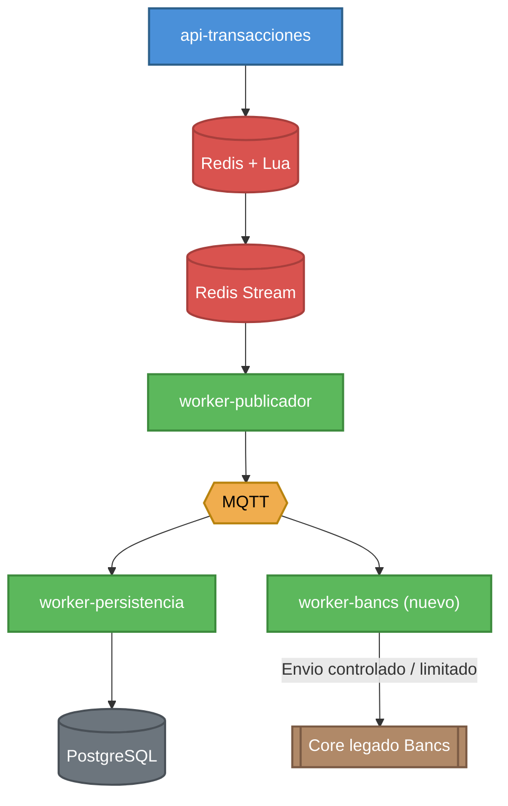
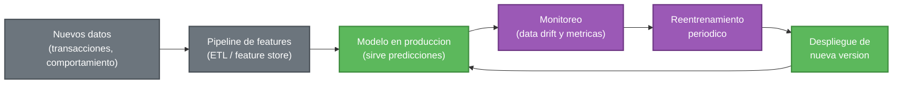

## Apartado practico reto tecnico

### 1. Estrategia de sincronizacion core legado "Bancs"

**Pregunta:** Diseñar en el documento el flujo de datos entre la nueva aplicacion y el core legado "Bancs", detallando como se actualizarian los saldos sin saturar el sistema legado.

La arquitectura permite responder al usuario de forma inmediata gracias a Redis, mientras el procesamiento hacia el core legado ocurre de forma asincronica. Siguiendo el mismo patron que ya usamos para persistencia e IA, se agregaria un `worker-bancs` que consume los eventos desde MQTT y actualiza los saldos en el core Bancs de forma controlada, por ejemplo limitando la tasa de envio o agrupando actualizaciones, en lugar de golpear el core legado con cada transaccion en tiempo real. Esto evita saturar un sistema que no fue diseñado para el volumen de transacciones concurrentes que si soporta Redis y permite reintentar o encolar los envios si el core legado responde lento o no esta disponible.

### 2. Manejo del modelo  de IA

**Pregunta:** Describir el ciclo de vida del modelo en produccion: como se alimenta con nuevos datos, como se monitorea el data drift y como se gestiona el consumo de recursos.

Pensando en un modelo de recomendacion financiera entrenado (no reglas fijas), asi es como plantearia su ciclo de vida en produccion:

- **Alimentacion con nuevos datos:** el modelo no deberia consumir cada transaccion en caliente, sino apoyarse en un pipeline (ETL o feature store) que va acumulando los datos nuevos (transacciones, comportamiento de los usuarios, historial de cuentas) y los deja listos en un formato consistente. Ese pipeline correria de forma periodica, por ejemplo diario o semanal, para no mezclar el flujo transaccional en tiempo real con el proceso de actualizacion del modelo.
- **Monitoreo de data drift:** se compara la distribucion de los datos que el modelo recibe en produccion contra la distribucion de los datos con los que fue entrenado. Si esas distribuciones se alejan mucho, por ejemplo cambia el rango tipico de montos o el comportamiento de gasto de los usuarios, es señal de que el modelo puede estar perdiendo precision aunque tecnicamente no este fallando. Esto se puede monitorear con metricas estadisticas simples (medias, percentiles, o el porcentaje de predicciones que caen en cada categoria) y generar una alerta automatica si el drift supera un umbral definido.
- **Gestion del consumo de recursos:** el modelo se serviria detras de un servicio de inferencia separado del flujo transaccional, para que una demora en generar la prediccion no afecte la respuesta de la transferencia. El consumo se controlaria con limites claros: tamaño maximo de cola de solicitudes, timeouts, autoscaling segun la carga, y metricas de uso de CPU/memoria (o GPU si aplica), evitando que el consumo crezca sin control durante picos.

Cuando el drift o la degradacion de las metricas de negocio superan el umbral definido, se dispararia un reentrenamiento con los datos nuevos acumulados, se validaria el modelo resultante contra un set de prueba, y si mejora o al menos no empeora las metricas clave, se desplegaria reemplazando la version anterior, idealmente con un rollout gradual en lugar de un cambio total e inmediato.

### 3. Diseño de observabilidad

**Pregunta:** Definir que informacion se utilizaria para identificar problemas de rendimiento, degradacion del servicio o fallos en la solucion propuesta, y justificar la utilidad de los datos seleccionados.

Para identificar problemas de rendimiento, degradacion del servicio emplearia:

| Metrica | Por que es la mas relevante |
|---|---|
| `smartbancs_http_transaccion_duracion_seconds` | Es la señal mas directa de la latencia que percibe el usuario final un aumento en el p95/p99 es el primer indicio de degradacion. |
| `smartbancs_timeouts_total` | Detecta de forma explicita problemas de conexion con la base de datos, que es justo el tipo de falla mas dificil de ver solo con latencia. |
| `smartbancs_errores_persistencia_total` | Aisla si el problema esta en la escritura hacia PostgreSQL y no en la API ni en Redis. |
| `smartbancs_redis_lua_duracion_seconds` | Confirma si el camino critico en Redis sigue respondiendo rapido, descartando esa capa como origen del problema. |
| `smartbancs_eventos_dlq_total` | Alerta sobre datos corruptos o invalidos que de otra forma se acumularian sin visibilidad. |

Estas cinco metricas por si solas ya permiten ubicar en que capa del flujo: API, Redis, o persistencia se origina un problema de rendimiento antes de tener que revisar logs uno por uno.

Los logs complementan a las metricas cuando ya se identifico el componente problematico: cada log incluye `trace_id`, `transaccion_id`, `estado`, `motivo` y `duracion`, y como el mismo `trace_id` viaja por todos los componentes: API, Redis Stream, MQTT, persistencia e IA, se puede buscar una transferencia especifica en Loki y reconstruir exactamente en que paso del flujo se quedo detenida o fallo.

### 4. Acciones inmediatas

**Escenario:** Durante un pico transaccional de quincena, los usuarios reportan que las transferencias no se completan. El sistema de monitoreo alerta sobre un incremento severo en la latencia de las peticiones, múltiples errores de timeout en la conexión con la base de datos y posibles bloqueos mutuos (deadlocks) en las tablas principales.

**Pregunta:** Definir acciones rápidas soluciones temporales, como finalizar conexiones bloqueadas, ajustar configuraciones de red o balancear cargas para estabilizar el sistema y evitar que los usuarios continúen afectados.

1. **Identificar el componente afectado:** usando Grafana y los `trace_id` en los logs, confirmar si el problema esta en `api-transacciones`, en Redis, o en la escritura hacia PostgreSQL, antes de tomar cualquier accion.
2. **Liberar bloqueos en la base de datos:** si se confirman deadlocks o conexiones colgadas en PostgreSQL, finalizar manualmente las conexiones o queries bloqueadas para liberar las tablas afectadas.
3. **Balancear la carga:** si un componente esta saturado de recursos, redirigir o distribuir el trafico hacia otra instancia o replica disponible en lugar de dejar que todo el trafico siga concentrado en el mismo servicio.
4. **Usar cache en operaciones estaticas:** para consultas que no cambian con frecuencia (por ejemplo, datos de cuenta o cliente), agregar una capa de cache reduce la carga repetida sobre PostgreSQL mientras dura el pico.
5. **Ajustar temporalmente los limites de conexion:** reducir el pool de conexiones hacia PostgreSQL o aplicar backpressure en la API evita que se sigan aceptando mas transacciones de las que el sistema puede procesar en ese momento.

### 5. Escalamiento y post mortem

**Pregunta:** Plantear la estructura del informe post mortem y definir que acciones preventivas se sugeririan en los ambitos de infraestructura y codigo para evitar que el escenario simulado se repita.

**Escenario:** durante un pico transaccional de quincena, los usuarios reportan que las transferencias no se completan. El sistema de monitoreo alerta sobre un incremento severo en la latencia de las peticiones, multiples errores de timeout en la conexion con la base de datos y posibles bloqueos mutuos (deadlocks) en las tablas principales.

**Estructura del informe post mortem:**

1. **Resumen ejecutivo:** que paso, cuanto tiempo duro y a quien afecto.
2. **Linea de tiempo del incidente:** crear una linea de tiempo desde la primera alerta hasta la resolucion, con hora exacta de cada evento relevante: deteccion, diagnostico, mitigacion, cierre.
3. **Impacto:** identificar numero de transacciones afectadas, tiempo de indisponibilidad o degradacion, usuarios impactados.
4. **Deteccion:** que metrica o alerta permitio detectar el problema puede ser latencia p95/p99 y timeouts de base de datos.
5. **Causa raiz:** explicacion tecnica de por que ocurrieron los deadlocks y timeouts durante el pico de quincena.
6. **Resolucion:** acciones tomadas para estabilizar el sistema en el momento del incidente.
7. **Acciones preventivas:** cambios concretos a futuro, separados por infraestructura y codigo (ver abajo).
8. **Responsables y seguimiento:** quien queda a cargo de implementar cada accion preventiva y para cuando.

**Acciones preventivas de infraestructura:**

- Configurar autoscaling o aumentar de forma anticipada los recursos de `api-transacciones` y los workers durante fechas conocidas de pico.
- Ajustar el tamaño del pool de conexiones hacia PostgreSQL para que no se agote durante picos de carga.
- Agregar una replica de lectura en PostgreSQL para separar las consultas de solo lectura de las escrituras criticas.
- Definir alertas proactivas basadas en umbrales de latencia y timeouts, para actuar antes de que el problema se vuelva critico.

**Acciones preventivas de codigo:**

- Revisar y optimizar los indices y queries que intervienen en las tablas donde ocurrieron los deadlocks.
- Garantizar un orden consistente de acceso a filas y tablas desde los distintos workers, para evitar que dos procesos se bloqueen mutuamente.
- Agregar timeouts y reintentos con backoff en las conexiones hacia PostgreSQL desde los workers.
- Reforzar el patron de commits por lotes que ya se usa en `worker-persistencia`, para reducir la frecuencia de escritura durante picos.
- Incluir el escenario de pico de quincena dentro de las pruebas de carga periodicas con k6, para detectar este tipo de degradacion antes de que ocurra en produccion.